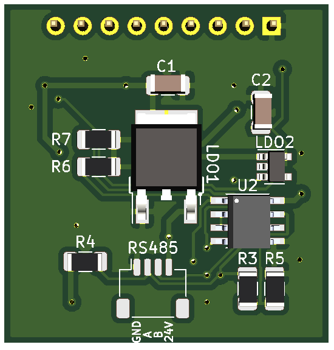

# Modbus RTU Sensor Hub

This PCB with limited footprint is designed to provide a robust and versitale sensor hub using Modbus RTU over RS485. 

# PCB

## General
PCB measurements: ca 32mm x 30.5mm

PCB Front                   | PCB Back
:--------------------------:|:-------------------------:
  |  

## Microcontroller
The sensor hub leverages the very capable ATtiny3216 (arduino compatible!).

- 32Kb flash, 2k SRAM - that's the same as an ATmega328p!
- 17 available I/O pins
- 8 PWM pins (6 on TCA0, 2 on TCD0) with 8-bit resolution.
- Servo, Tone, Serial, SPI and Wire (I2C) support "just works"
- 2 Type B timers - so Servo and Tone can both be used simultaneously, or one or both can be taken over for input capture, periodic interrupt, or other functionality.
- DAC output (just do analogWrite() on the DAC pin - voltage is between 0V and the DAC reference voltage, which can be set with setDACReference() ).
- 11 analog inputs, referenced to Vcc, external reference, or one of the 5 built-in analog references.
Internal clock at up to 20MHz at 5v, up to 10MHz at 3.3v

## Capabilities 

- wide range of allowed power supply voltage: 7-30V
- onboard convertor for 3.3V power supply (300mA max)
- onboard convertor for 5V power supply (1.5A max, board power consumption not included)
- dedicated RS485 connector
- dedicated 1-Wire connector
- dedicated UDPI connector
- dedicated SPI connector
- dedicated I²C connector
- X digital pins
- X analogs pins 

# Getting started

- [Required Soldering Materials]()
- [BOM (Bill Of Materials)]()
- [Ordering the PCB's]()
- [Soldering the PCB's]()
- [Building a FTDI programmer]()
- [Loading the bootloader]()
- [Programming]()

# Example projects
