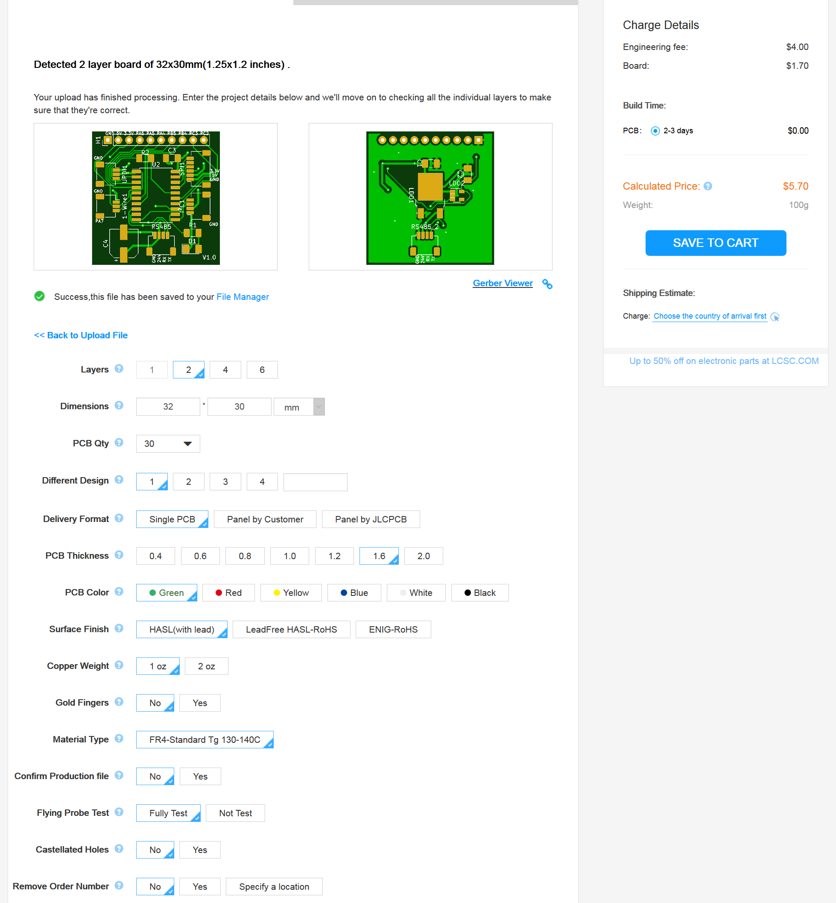

## Ordering the PCBs
In this example [JLCPCB]() is used to order the PCBs.

1. Go to [JLCPCB]() and register if haven't already
1. Go to the 'Order Now' page
1. Upload the zip file found under [src](https://github.com/MichielVanwelsenaere/HomeAutomation.ModbusRtuSensorHub/tree/master/src)
1. Select the desired quantity of PCBs
1. Press 'Save To Cart' and finish your order

Below is an example including price of 30 PCBs:
