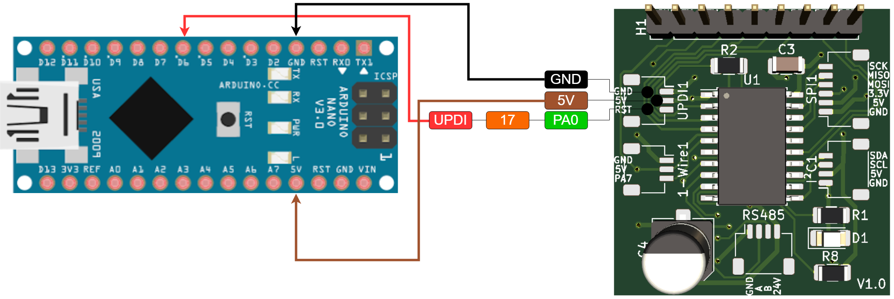

## Programming

### Wire Diagram
Wire up the board to the UPDI programmer as shown below:

When doing so, please disconnect any other powersupply to the board.

### Arduino IDE Preferences

1. (In the Arduino IDE) File > Preferences
1. Uncheck the checkbox next to "Show verbose output during: compilation"
1. Check the checkbox next to "Show verbose output during: upload
1. Click "OK"

This will avoid the error 'avrdude: jtagmkII_initialize(): Cannot locate "flash" and "boot" memories in description' during an upload. This is a spurious warning and can be safely ignored.

### Arduino IDE Tools Settings
Check if the following configuration is set before attempting an upload:

### Arduino IDE Upload using programmer
Use the following to upload the sketch to the board using the UPDI programmer:

