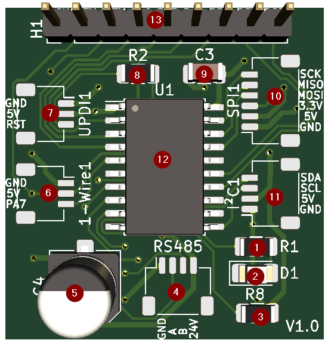
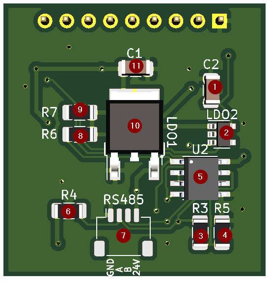

## Soldering the PCBs
Leverage the approach, tips & advice below to solder the board(s) together with the [BOM](./BOM).

### Soldering Order

On the front side of the board, solder the components in the following order:

On the back side of the board, solder the components in the following order:

Note: this soldering order is a result of personal experience. Naturally you can solder the board in any order you see fit.